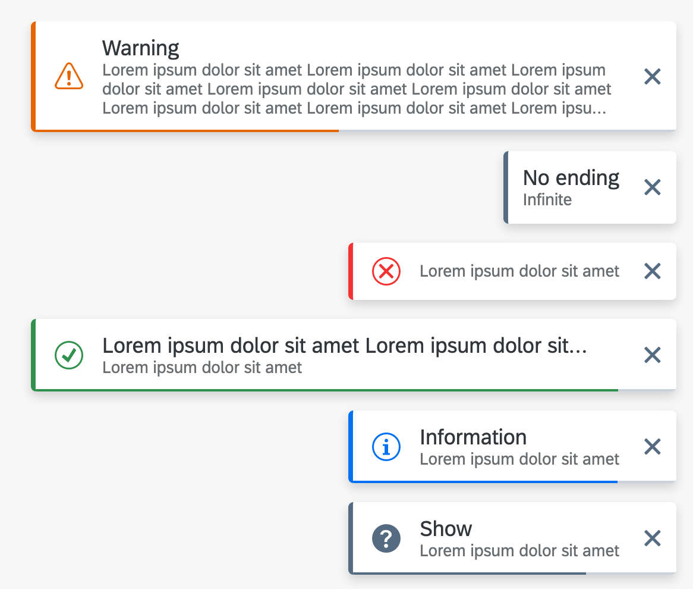
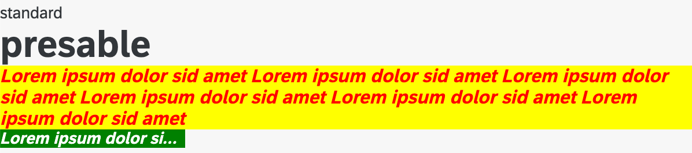

# dev.carlosorozco.ui5Extra

UI5 lib with extra controls

> ❌ ¡Attention! I'm doing this library for fun and it's in development mode

# Controls

## Toast

- Toast launcher with: states, title, duration, loaderBar, autoClose, apilable

## Text

- Text control with: color, backgroundColor, fontSize, fontWeight, fontStyle, cursor, press
- The absolute anti-fiori text control 😂
- Extends `sap/m/Text`

## ODataFetch

- ODataModel for ts/js use. Uses promises so you can use async/await syntax. Also it is possible to auto-abort duplicate fetchs with `abortId`. For ts developers, it uses generics so you can customize the typings without using "as Type".
- Extends `sap/ui/model/odata/v2/ODataModel`

# Docs

- [Docs Link](https://carlosorozco88.github.io/ui5-extra/)

# Links

- Carlos Orozco - [Website](https://carlosorozco.dev)
